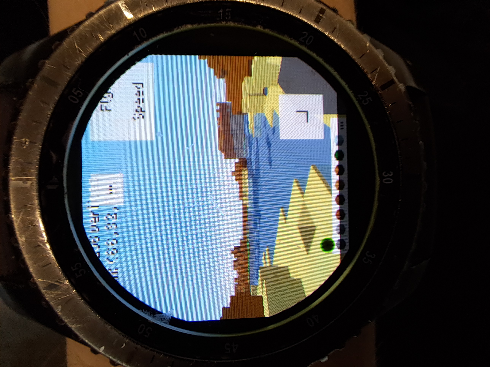

[ClassiCube Repo](https://github.com/ClassiCube/ClassiCube)
# ClassiCubeGear
 
ClassiCube (poorly) ported to Tizen wearables.
This is just the web version of ClassiCube with a modified ClassiCube.js file to make the touch controls appear.

## What brokey?
Texture's are broken, default.zip exists but yeah nothing.
Sound is gone because its the web version.
Quit Game button removes the game window leaving the user in nothing.b

## oy readme please
This might not work on all watches, at least tizen 4.0 watches.
If your sure your watch can run Tizen 4 apps and have some knowledge with Tizen Studio, go ahead and try it!
And if it works please do not press the quit game button, because that just kinda breaks the game so you have to fuly close it and reopen it.

## INSTALL NOW??
that is a bit difficault because (like i said above) you gotta have a good enough undertanding of Tizen Studio so yeaaaaaaaaahhh..... I might make a tutorial some day.
